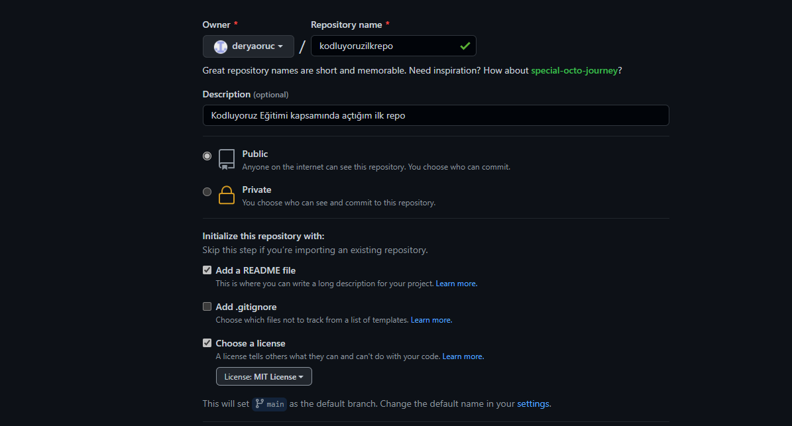

# Kodluyoruz İlk Repo
-----------------------------------------------------------------------------------------------------

Bu repo [Kodluyoruz](https://www.kodluyoruz.org/) Front-End Eğitiminde oluşturduğumuz ilk repo. İçerisinde bir adet README dosyası, bir adet index.html barındırıyor.

## Installation
-----------------------------------------------------------------------------------------------------

Öncelikle projeyi clonelayın. (Buraya sizin reponuzdan aldığınız link gelecek)

`git clone https://github.com/deryaoruc/kodluyoruzilkrepo.git`

## Usage
-----------------------------------------------------------------------------------------------------

Projeyi cloneladıktan sonraVisual Studio Code programında açınız.

Linux içim:

`cd kodluyoruzilkrepocode .`

## Contributing
-----------------------------------------------------------------------------------------------------

Pull requestler kabul edilir. Büyük değişiklikler için, lütfen önce neyi değiştirmek istediğinizitartışmak için bir konu açınız.

## License 
-----------------------------------------------------------------------------------------------------

[MIT](https://mit-license.org/)